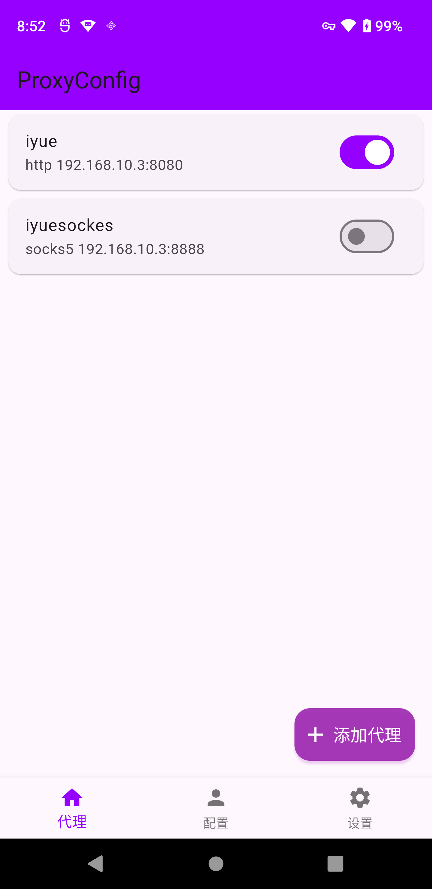
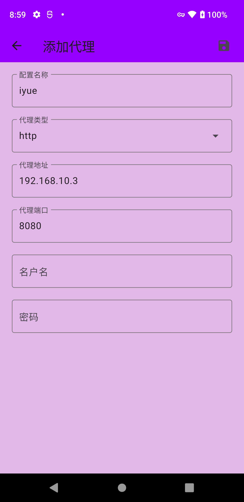
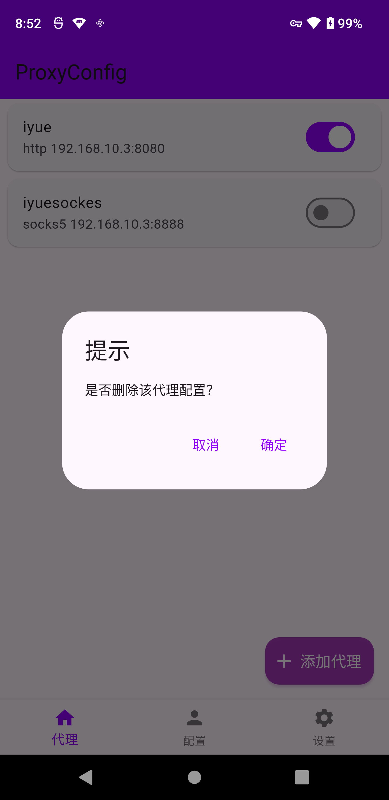
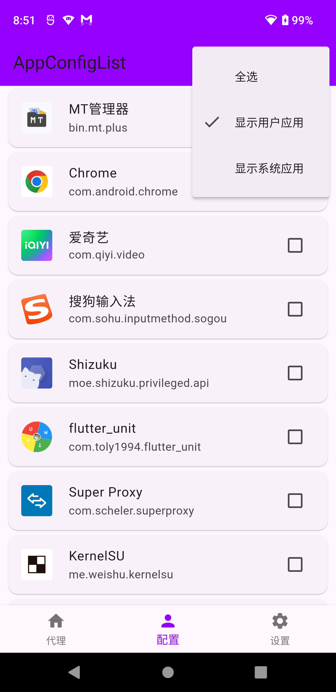
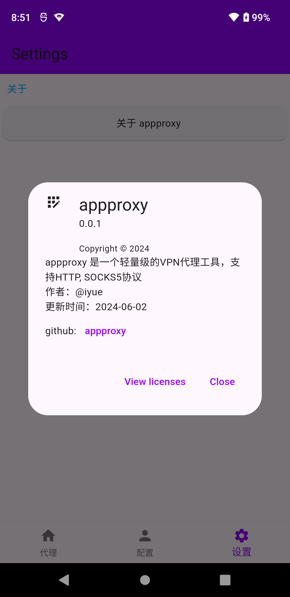

# [appproxy](https://github.com/ys1231/appproxy)

## 项目背景

- 在分析app的时候,偶尔需要抓包,尝试了目前比较常见的代理工具
- `Drony` `Postern` `ProxyDroid` 发现都有一个相同的问题,对于较新的Android系统不太友好,要么app列表显示不正常,或者界面过于复杂,往往设置之后经常会失效,偶然在play上发现一个比较新的代理工具,界面很不错清晰不过对国内用户不友好有些功能需要会员,即使花钱由于不维护或者网络原因,完整的功能无法使用于是在业余时间开发了这个.

## 项目简介

1. 基于flutter和[tun2socks](https://github.com/xjasonlyu/tun2socks)开发.
2. [appproxy](https://github.com/ys1231/appproxy) 是一个轻量级的VPN代理工具，支持HTTP, SOCKS5协议
3. 功能单只做代理,可分app代理, 双击修改配置逻辑比较简单, 主打一个能用就行.
4. 出于学习熟悉flutter的目的去做的,分享给大家,顺便帮我测试一下.
5. 加上[MoveCertificate](https://github.com/ys1231/MoveCertificate) 上下游都有了哈哈.


## 附上截图











# 依赖项目
- [tun2socks](https://github.com/xjasonlyu/tun2socks)

# 开发

```shell
# 如果发现Android Studio 调试flutter 自动跳到一个只读的文件,调试的时候无法修改代码,可以恢复上一个版本,是的坑.
# 推荐 Android Studio Iguana | 2023.2.1 Patch 2
```

# 免责声明
- 本程序仅用于学习交流, 请勿用于非法用途.
