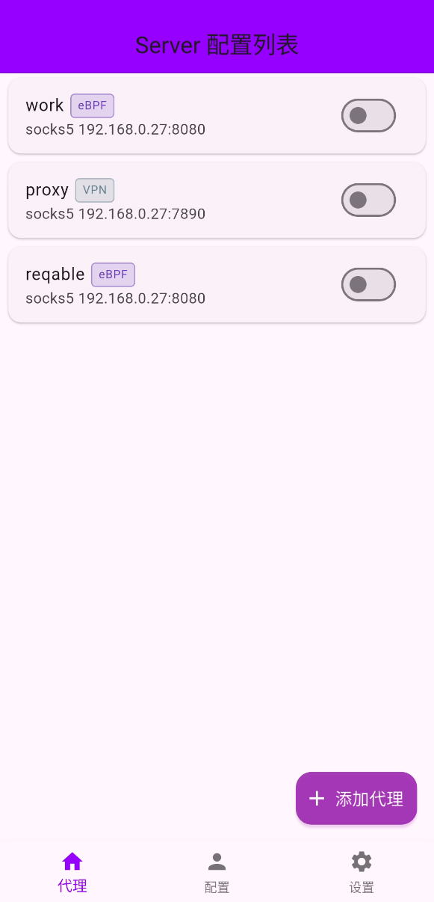
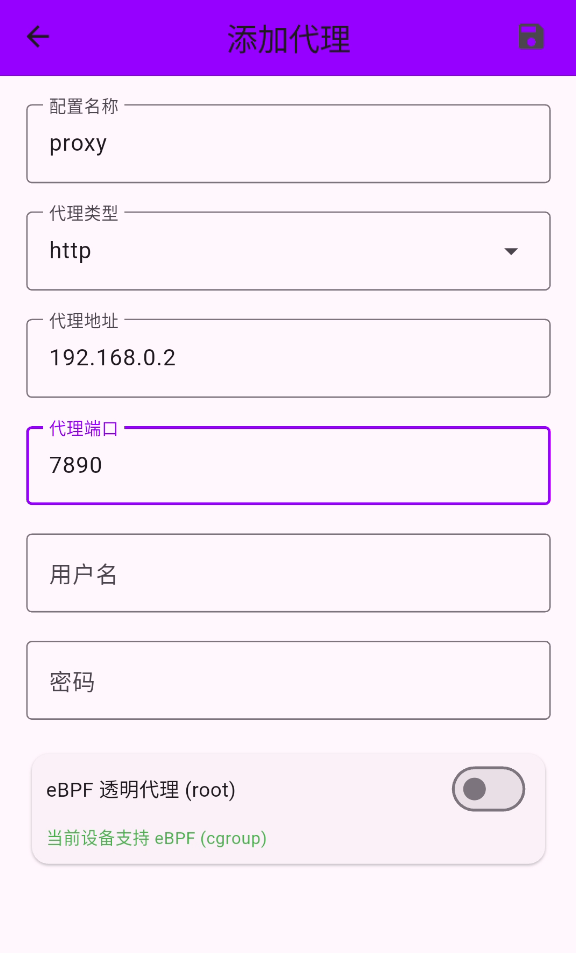
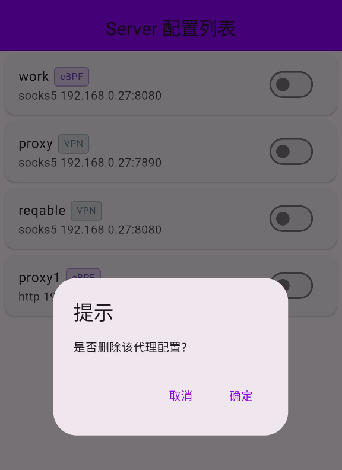
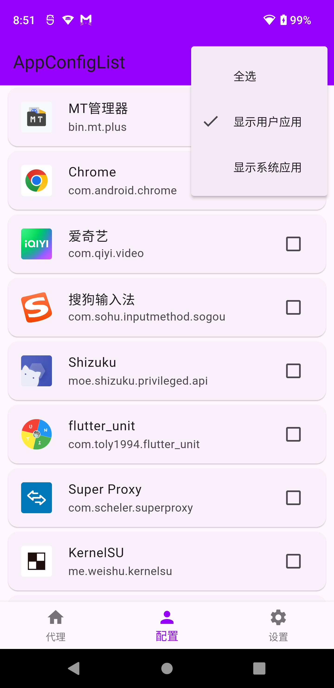
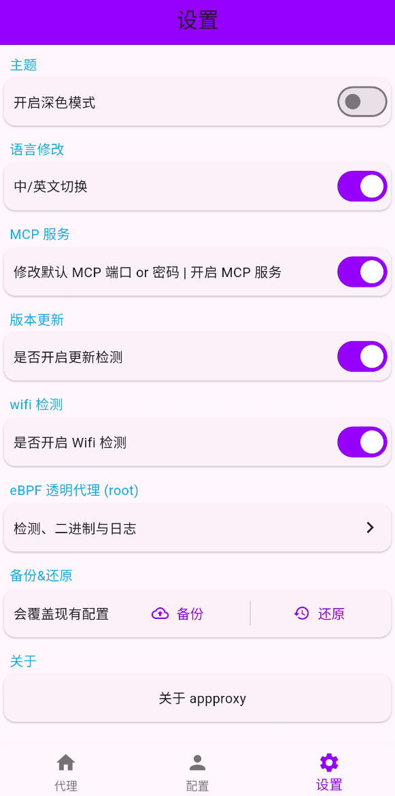
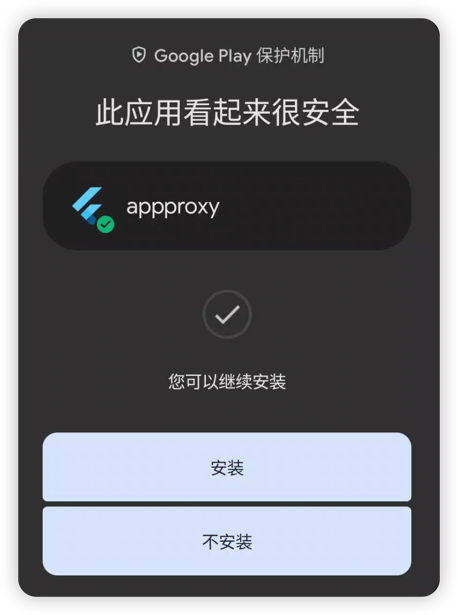

# [appproxy](https://github.com/ys1231/appproxy)

## 项目背景

- 在分析app的时候,偶尔需要抓包,尝试了目前比较常见的代理工具
- `Drony` `Postern` `ProxyDroid` 发现都有一个相同的问题,对于较新的Android系统不太友好,要么app列表显示不正常,或者界面过于复杂,往往设置之后经常会失效,偶然在play上发现一个比较新的代理工具,界面很不错清晰不过对国内用户不友好有些功能需要会员,即使花钱由于不维护或者网络原因,完整的功能无法使用于是在业余时间开发了这个.

## 项目简介

1. 基于 `flutter` 和[tun2socks](https://github.com/xjasonlyu/tun2socks)开发，更多详细信息[![zread](https://img.shields.io/badge/Ask_Zread-_.svg?style=flat-square&color=00b0aa&labelColor=000000&logo=data%3Aimage%2Fsvg%2Bxml%3Bbase64%2CPHN2ZyB3aWR0aD0iMTYiIGhlaWdodD0iMTYiIHZpZXdCb3g9IjAgMCAxNiAxNiIgZmlsbD0ibm9uZSIgeG1sbnM9Imh0dHA6Ly93d3cudzMub3JnLzIwMDAvc3ZnIj4KPHBhdGggZD0iTTQuOTYxNTYgMS42MDAxSDIuMjQxNTZDMS44ODgxIDEuNjAwMSAxLjYwMTU2IDEuODg2NjQgMS42MDE1NiAyLjI0MDFWNC45NjAxQzEuNjAxNTYgNS4zMTM1NiAxLjg4ODEgNS42MDAxIDIuMjQxNTYgNS42MDAxSDQuOTYxNTZDNS4zMTUwMiA1LjYwMDEgNS42MDE1NiA1LjMxMzU2IDUuNjAxNTYgNC45NjAxVjIuMjQwMUM1LjYwMTU2IDEuODg2NjQgNS4zMTUwMiAxLjYwMDEgNC45NjE1NiAxLjYwMDFaIiBmaWxsPSIjZmZmIi8%2BCjxwYXRoIGQ9Ik00Ljk2MTU2IDEwLjM5OTlIMi4yNDE1NkMxLjg4ODEgMTAuMzk5OSAxLjYwMTU2IDEwLjY4NjQgMS42MDE1NiAxMS4wMzk5VjEzLjc1OTlDMS42MDE1NiAxNC4xMTM0IDEuODg4MSAxNC4zOTk5IDIuMjQxNTYgMTQuMzk5OUg0Ljk2MTU2QzUuMzE1MDIgMTQuMzk5OSA1LjYwMTU2IDE0LjExMzQgNS42MDE1NiAxMy43NTk5VjExLjAzOTlDNS42MDE1NiAxMC42ODY0IDUuMzE1MDIgMTAuMzk5OSA0Ljk2MTU2IDEwLjM5OTlaIiBmaWxsPSIjZmZmIi8%2BCjxwYXRoIGQ9Ik0xMy43NTg0IDEuNjAwMUgxMS4wMzg0QzEwLjY4NSAxLjYwMDEgMTAuMzk4NCAxLjg4NjY0IDEwLjM5ODQgMi4yNDAxVjQuOTYwMUMxMC4zOTg0IDUuMzEzNTYgMTAuNjg1IDUuNjAwMSAxMS4wMzg0IDUuNjAwMUgxMy43NTg0QzE0LjExMTkgNS42MDAxIDE0LjM5ODQgNS4zMTM1NiAxNC4zOTg0IDQuOTYwMVYyLjI0MDFDMTQuMzk4NCAxLjg4NjY0IDE0LjExMTkgMS42MDAxIDEzLjc1ODQgMS42MDAxWiIgZmlsbD0iI2ZmZiIvPgo8cGF0aCBkPSJNNCAxMkwxMiA0TDQgMTJaIiBmaWxsPSIjZmZmIi8%2BCjxwYXRoIGQ9Ik00IDEyTDEyIDQiIHN0cm9rZT0iI2ZmZiIgc3Ryb2tlLXdpZHRoPSIxLjUiIHN0cm9rZS1saW5lY2FwPSJyb3VuZCIvPgo8L3N2Zz4K&logoColor=ffffff)](https://zread.ai/ys1231/appproxy)
2. [appproxy](https://github.com/ys1231/appproxy) 是一个轻量级的VPN代理工具，支持HTTP, SOCKS5协议.
3. 功能单只做代理,可分app代理, **双击修改配置** 逻辑比较简单, 主打一个能用就行.
4. 出于学习熟悉flutter的目的去做的,分享给大家,顺便帮我测试一下.
5. 加上[MoveCertificate](https://github.com/ys1231/MoveCertificate) 上下游都有了哈哈.
6. 支持 `Android 9` 及以上版本， 低于 `android 9` 推荐使用 `postern`
7. 支持 `MCP` 远程调用, ip 地址为手机 ip， 默认端口为 `12345`, 默认`auth`为 `appproxy`
```json
{
  "mcpServers": {
    "appproxy-mcp": {
      "type": "http",
      "url": "http://192.168.0.10:12345/mcp",
      "headers": {
        "Authorization": "Bearer appproxy"
      }
    }
  }
}
```
|MCP 工具|描述|
|---|---|
|`start_proxy`|使用指定的主机、端口、类型、鉴权信息及按应用代理包列表启动代理|
|`stop_proxy`|停止正在运行的代理服务|
|`get_proxy_status`|检查代理当前是否处于活跃状态|
|`get_proxy_config`|获取当前的代理配置|
|`update_proxy_config`|修改运行中的代理参数（如有需要会触发重启）|

## 重要的事情说三遍

- **双击修改配置**
- **双击修改配置**
- **双击修改配置**

## 附上截图














# 依赖项目
- [tun2socks](https://github.com/xjasonlyu/tun2socks)
- [MCP](https://github.com/modelcontextprotocol/kotlin-sdk/tree/main/samples/simple-streamable-server) 参考项目
# 开发

## 继续开发
- 请基于 `iyue` 创建分支开发

## build tun2socks

```shell
./btun2socks.sh
```

```shell
# 如果发现Android Studio 调试flutter 自动跳到一个只读的文件,调试的时候无法修改代码,可以恢复上一个版本,是的坑.
# 推荐 "Android Studio Iguana | 2023.2.1 Patch 2" -> "Android Studio Meerkat | 2024.3.1 Patch 1"
# line 设置为 100
flutter --no-color pub global run intl_utils:generate
flutter build apk --release --split-per-abi --build-name=$VERSION --dart-define=BUILD_DATE=$(date +%Y-%m-%d) --obfuscate --split-debug-info ./build/
```

## flutter shorebird 热更新

- [appproxy](https://github.com/ys1231/appproxy) 已经绑定可强制更新 `app_id`
```shell
# linux && mac
curl --proto '=https' --tlsv1.2 https://raw.githubusercontent.com/shorebirdtech/install/main/install.sh -sSf | bash
# windows
# Set-ExecutionPolicy RemoteSigned -scope CurrentUser
# iwr -UseBasicParsing 'https://raw.githubusercontent.com/shorebirdtech/install/main/install.ps1'|iex

# 官网注册
https://console.shorebird.dev/login
# shell 登录
shorebird login
# 初始化项目 在 flutter 项目下执行即可
shorebird init
# 编译
shorebird release -p android --artifact apk 
# 打补丁
shorebird patch --platforms=android
```

## Star History

[](https://star-history.dera.page/#ys1231/appproxy&Date)

# 免责声明
- 本程序仅用于学习交流, 请勿用于非法用途.
